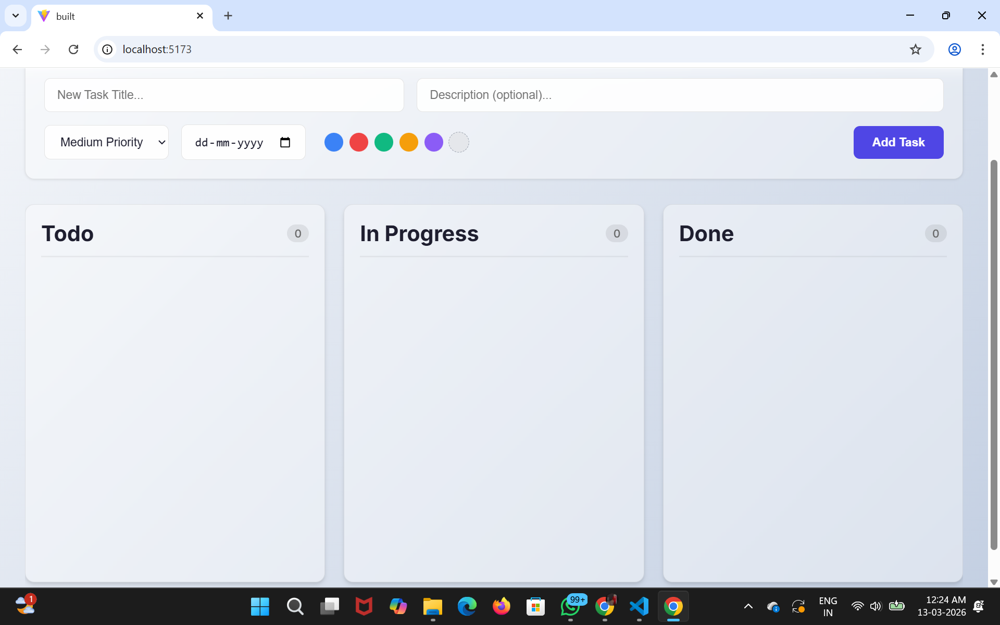
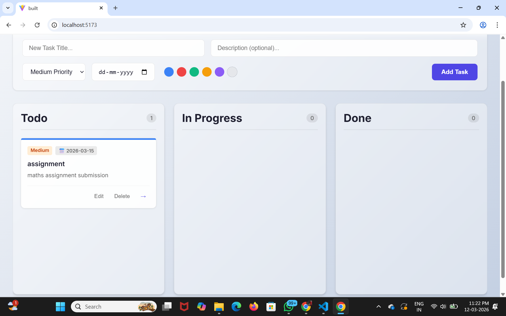

A modern Kanban-style task management web application built using the React.
The web application will allow users to manage their tasks according to various workflow stages such as Todo, In Progress, and Done using an interactive drag and drop facility.

The features of the web application will be task addition, editing, and deletion. Local storage will be employed to maintain the state of the application so that the tasks will be preserved even if the page is reloaded. The layout of the web application will be clean and visually appealing.

The project will cover various concepts of front-end web development.

## Screenshots

### Kanban Board Interface

### Drag and Drop Tasks

### Add New Task
